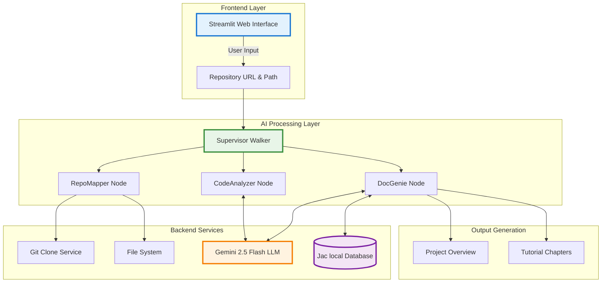
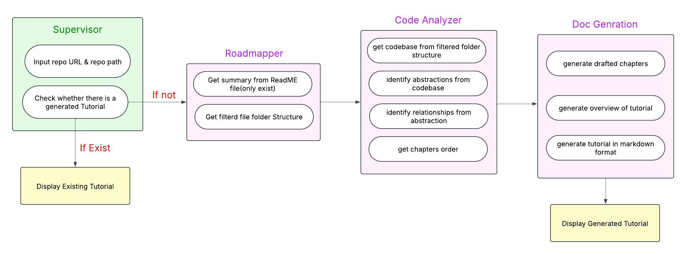
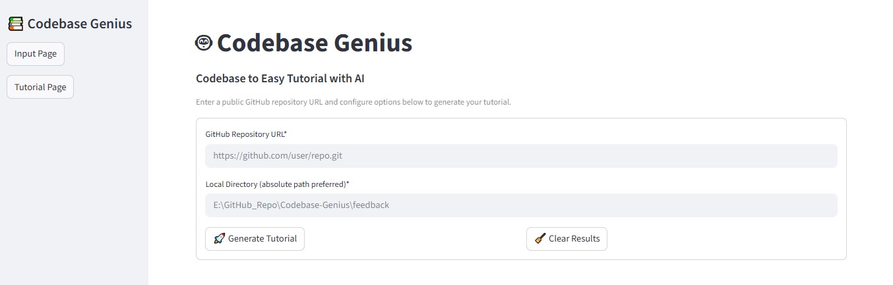

# 🤖 Codebase Genius

An AI-powered tool that transforms any GitHub repository into comprehensive, beginner-friendly tutorials automatically. Turn complex codebases into educational masterpieces with the power of AI!

## Overview

**Codebase Genius** revolutionizes how developers understand and learn from unfamiliar codebases. Instead of spending hours digging through code, documentation, and trying to understand project architecture, our AI-powered system does the heavy lifting for you.

### The Idea

Imagine being able to:
- **Clone any GitHub repository** and instantly get a complete tutorial
- **Understand complex projects** in minutes, not hours
- **Learn from real-world codebases** with AI-generated explanations
- **Get beginner-friendly documentation** for any programming language or framework

### 🎯 Scope

Codebase Genius works with **any type of repository** - whether it's Python, JavaScript, Java, C++, Flutter, or even specialized languages like Jac. Our AI understands the patterns, extracts the core concepts, and creates structured learning materials that make sense to developers at any level.

---

## High-Level Architecture

Our system follows a clean, modular architecture with three main components working in harmony:



---

## High-Level Workflow

<div align="center">
  
  <p><em>Complete workflow showing how Codebase Genius transforms repositories into tutorials</em></p>
</div>

---

## Core Functionalities

### **Intelligent Repository Analysis**
- **Smart File Filtering**: Automatically identifies and focuses on essential source code files
- **Abstraction Extraction**: Uses AI to identify key programming concepts and patterns
- **Relationship Mapping**: Discovers how different components interact with each other
- **Architecture Understanding**: Comprehends the overall system design and data flow

### **AI-Powered Tutorial Generation**
- **Chapter Organization**: Structures content in logical learning progression
- **Beginner-Friendly Explanations**: Converts complex code into understandable concepts
- **Visual Diagrams**: Generates Mermaid diagrams for architectural understanding

### **Universal Language Support**
- **Multi-Language Compatibility**: Works with Python, JavaScript, Java, C++, Flutter, Dart, Go, Rust, and more
- **Framework Recognition**: Understands popular frameworks like React, Django, Spring, Flutter, etc.
- **Specialized Languages**: Supports unique languages like Jac (Jaseci Action Language)
- **Mixed Codebases**: Handles projects with multiple programming languages

### **Local Database Integration**
- **Jac Database**: Serves tutorials through local database for fast access
- **Caching System**: Stores processed tutorials to avoid regeneration
- **Persistent Storage**: Maintains generated content across sessions

---

## 📥 Input & 📤 Output

### **What You Provide**
```
 GitHub Repository URL
           Example: https://github.com/user/awesome-project.git

 Local Directory Path  
           Example: E:\Projects\MyAnalysis\awesome-project
```

<div align="center">
  
  <p><em>Input interface for providing GitHub repository URL and local directory path</em></p>
</div>

### **What You Get**
<div align="center">
  
  <p><em>Clean and intuitive web interface for generating AI-powered tutorials</em></p>
</div>

> Also you can download the complete tutorial as the Markdown file by clicking "Download Tutorial"


## 💡 Development Tutorial & Demonstration

### **Watch the Magic in Action**

<div align="center">
  <a href="https://www.youtube.com/watch?v=HP4tnDDxezI" target="_blank">
    
  </a>
  <p><em>🎥 Click here to see how Codebase Genius transforms complex repositories into beginner-friendly tutorials</em></p>
</div>

---

## 📖 Generated Tutorials Showcase
**All these tutorials are generated entirely by using Codebase Genius!**

- **[Airvix-App](./generated%20tutorials/AirvixApp_tutorial.md)** - Smart AC Control with Firebase & Flutter (`Dart + Firebase + IoT`)
- **[Intelligent-Command-ControlSystem](./generated%20tutorials/IntelligentCommandControlSystem_tutorial.md)** - Command-controlled IoT devices with ESP32 (`Jac + Python + ESP32/C++`)
- **[Feedback-Agent](./generated%20tutorials/FeedbackAgent_tutorial.md)** - Customer sentiment analysis with AI (`Python + Streamlit + AI`)
- **[Vocabulary-Trainer](./generated%20tutorials/VocabularyTrainer_tutorial.md)** - AI-powered vocabulary learning game (`Jac + Python + LLM`)
  
For furthur details, [click here](./generated%20tutorials).

> 💡 Each tutorial includes beginner-friendly explanations, architectural diagrams, and step-by-step code walkthroughs - all generated automatically by understanding the repository structure and code patterns!

---

## 🔧 Technologies & Tools Used

* **Jac Language** – Agent-oriented programming with native LLM integration (`jaclang`, `jac-cloud`)
* **mtllm** – Multi-tool LLM framework for reasoning and function calling with ReAct methodology
* **Google Gemini 2.5 Flash** – Advanced AI for code understanding and generation (`google-generativeai`)
* **Streamlit** – Interactive web interface with real-time updates and progress tracking
* **GitPython** – Seamless Git repository operations and cloning
* **Jaseci Runtime** – Local database and walker execution engine for caching
* **Git** – Version control and repository management

> 
> 
> 
> 
> 
> 

---

## 🚀 Getting Started

### Installation

1. **Clone the repository**:
   ```bash
   git clone https://github.com/SahanUday/Codebase-Genius.git
   cd Codebase-Genius
   ```

2. **Install dependencies**:
   ```bash
   pip install -r requirements.txt
   ```

3. **Set up your Google API key**:
   ```bash
   # Windows (PowerShell)
   $env:GOOGLE_API_KEY="your_api_key_here"
   ```

4. **Start the application**:
   ```bash
   # 1: Run the Jac backend directly
   jac serve main.jac
   
   # 2: Run the Streamlit web interface
   streamlit run app.py
   ```

5. **Access the application**:
   - Open your browser to `http://localhost:8501`
   - Enter a GitHub repository URL
   - Specify a local directory path
   - Click "Generate Tutorial" and watch the magic happen! ✨

---

## 📁 Project Structure

```
Codebase-Genius/
   ├── main.jac                # Main entry point and supervisor walker
   ├── main.impl.jac           # Implementation of core nodes and walkers
   ├── utils.jac               # Utility functions and LLM integrations
   └── app.py                  # Streamlit web interface

```

### **Core Files Explained**

| File | Purpose | Technology |
|------|---------|------------|
| `main.jac` | Defines the node architecture and main walker logic | Jac Language |
| `main.impl.jac` | Contains all implementations for repository analysis | Jac + Python |
| `utils.jac` | LLM utilities and helper functions with ReAct method | Jac + mtllm |
| `app.py` | Web interface for user interaction | Streamlit + Python |

---

## 🚀 Future Enhancements

- **Multi-Model Support**: Integration with GPT-4, Claude, and other LLMs for comparative analysis
- **Interactive Q&A**: Real-time code explanation with conversational AI assistance
- **Discussion Integration**: Comment threads and Q&A sections within tutorials
- **Multi-Language Support**: Tutorials in different human languages
- **Database Scaling**: Support for thousands of cached tutorials
- **Voice-to-Tutorial**: Generate tutorials from verbal descriptions
- **Add Validation Conditions**:  For Repository URLs, Local Directory Paths, Code Quality Assessment, API Rate Limiting etc.

---

## 📜 License

This project is licensed under the **MIT License** - see the [LICENSE](LICENSE) file for details.
