# 🤖 Codebase Genius

An AI-powered tool that transforms any GitHub repository into comprehensive, beginner-friendly tutorials automatically. Turn complex codebases into educational masterpieces with the power of AI!

## 🌟 Overview

**Codebase Genius** revolutionizes how developers understand and learn from unfamiliar codebases. Instead of spending hours digging through code, documentation, and trying to understand project architecture, our AI-powered system does the heavy lifting for you.

### 💡 The Idea

Imagine being able to:
- **Clone any GitHub repository** and instantly get a complete tutorial
- **Understand complex projects** in minutes, not hours
- **Learn from real-world codebases** with AI-generated explanations
- **Get beginner-friendly documentation** for any programming language or framework

### 🎯 Scope

Codebase Genius works with **any type of repository** - whether it's Python, JavaScript, Java, C++, Flutter, or even specialized languages like Jac. Our AI understands the patterns, extracts the core concepts, and creates structured learning materials that make sense to developers at any level.

## 🏗️ High-Level Architecture

Our system follows a clean, modular architecture with three main components working in harmony:

```mermaid
graph TB
    subgraph "🌐 Frontend Layer"
        UI[Streamlit Web Interface]
        UI --> |User Input| INPUT[Repository URL & Path]
    end
    
    subgraph "🧠 AI Processing Layer"
        SUPERVISOR[Supervisor Walker]
        REPO[RepoMapper Node]
        CODE[CodeAnalyzer Node] 
        DOC[DocGenie Node]
        
        SUPERVISOR --> REPO
        REPO --> CODE
        CODE --> DOC
    end
    
    subgraph "🔧 Backend Services"
        GIT[Git Clone Service]
        LLM[Gemini 2.5 Flash LLM]
        DB[(Jaseci Database)]
        FILE[File System]
    end
    
    subgraph "📊 Output Generation"
        OVERVIEW[Project Overview]
        CHAPTERS[Tutorial Chapters]
        DIAGRAMS[Mermaid Diagrams]
    end
    
    INPUT --> SUPERVISOR
    REPO --> GIT
    REPO --> FILE
    CODE --> LLM
    DOC --> LLM
    DOC --> DB
    
    DOC --> OVERVIEW
    DOC --> CHAPTERS
    DOC --> DIAGRAMS
    
    style UI fill:#E3F2FD,stroke:#1976D2,stroke-width:3px
    style SUPERVISOR fill:#E8F5E8,stroke:#388E3C,stroke-width:3px
    style LLM fill:#FFF3E0,stroke:#F57C00,stroke-width:3px
    style DB fill:#F3E5F5,stroke:#7B1FA2,stroke-width:3px
```



## ⚡ Core Functionalities

### � **Intelligent Repository Analysis**
- **Smart File Filtering**: Automatically identifies and focuses on essential source code files
- **Abstraction Extraction**: Uses AI to identify key programming concepts and patterns
- **Relationship Mapping**: Discovers how different components interact with each other
- **Architecture Understanding**: Comprehends the overall system design and data flow

### 📚 **AI-Powered Tutorial Generation**
- **Chapter Organization**: Structures content in logical learning progression
- **Beginner-Friendly Explanations**: Converts complex code into understandable concepts
- **Visual Diagrams**: Generates Mermaid diagrams for architectural understanding
- **Code Examples**: Provides relevant code snippets with detailed explanations

### 🌐 **Universal Language Support**
- **Multi-Language Compatibility**: Works with Python, JavaScript, Java, C++, Flutter, Dart, Go, Rust, and more
- **Framework Recognition**: Understands popular frameworks like React, Django, Spring, Flutter, etc.
- **Specialized Languages**: Supports unique languages like Jac (Jaseci Action Language)
- **Mixed Codebases**: Handles projects with multiple programming languages

### 🗄️ **Local Database Integration**
- **Jaseci Database**: Serves tutorials through local Jaseci database for fast access
- **Caching System**: Stores processed tutorials to avoid regeneration
- **Persistent Storage**: Maintains generated content across sessions

## 🚀 Features

### 🎯 **Advanced AI Capabilities**
- **ReAct Methodology**: Uses Reasoning + Acting approach for better LLM function calls
- **Google Gemini 2.5 Flash**: Leverages cutting-edge AI for code understanding
- **Context-Aware Processing**: Maintains context across large codebases
- **Adaptive Learning**: Improves analysis based on repository patterns

### 🔧 **Developer-Friendly Tools**
- **Web Interface**: Clean, intuitive Streamlit-based UI
- **Real-time Processing**: Live updates during tutorial generation
- **Download Options**: Export tutorials as Markdown files
- **Progress Tracking**: Visual feedback during processing steps

### 🌍 **Repository Versatility**
- **Public GitHub Repos**: Works with any publicly accessible repository
- **Large Codebases**: Handles projects with thousands of files efficiently
- **Documentation Integration**: Incorporates existing README and docs
- **Multi-Module Projects**: Understands complex project structures

## 📥 Input & 📤 Output

### 📥 **What You Provide**
```
🔗 GitHub Repository URL
   └── Example: https://github.com/user/awesome-project.git

📁 Local Directory Path  
   └── Example: E:\Projects\MyAnalysis\awesome-project

⚙️ Optional Configuration
   └── Custom analysis parameters
```

### 📤 **What You Get**
```
📖 Comprehensive Tutorial
   ├── 🎯 Project Overview
   ├── 📚 Structured Chapters
   ├── 🗺️ Architecture Diagrams
   ├── 💡 Key Concepts Explained
   └── 🔗 Interactive Navigation

📊 Visual Documentation
   ├── 🎨 Mermaid Diagrams
   ├── 📈 System Flow Charts
   └── 🏗️ Component Relationships

💾 Exportable Content
   ├── 📝 Markdown Files
   ├── 🌐 Web-Friendly Format
   └── 📱 Mobile-Responsive Layout
```

<!-- Uncomment when webapp.jpg is available
## 🖼️ Application Preview

<div align="center">
  
  <p><em>Clean and intuitive web interface for generating AI-powered tutorials</em></p>
</div>
-->

## 🎓 Generated Tutorials Showcase

🤯 **All these tutorials are generated entirely by AI by crawling GitHub repositories!**

### 📱 **Mobile & IoT Projects**
- 🌡️ **[AirvixApp](./generated%20tutorials/AirvixApp_tutorial.md)** - Smart AC Control with Firebase & Flutter (`Dart + Firebase + IoT`)
- 🎮 **[IntelligentCommandControlSystem](./generated%20tutorials/IntelligentCommandControlSystem_tutorial.md)** - Voice-controlled IoT devices with ESP32 (`Jac + Python + ESP32/C++`)

### 🤖 **AI & Machine Learning**
- 📊 **[FeedbackAgent](./generated%20tutorials/FeedbackAgent_tutorial.md)** - Customer sentiment analysis with AI (`Python + Streamlit + AI`)
- 📚 **[VocabularyTrainer](./generated%20tutorials/VocabularyTrainer_tutorial.md)** - AI-powered vocabulary learning game (`Jac + Python + LLM`)

> 💡 Each tutorial includes beginner-friendly explanations, architectural diagrams, and step-by-step code walkthroughs - all generated automatically by understanding the repository structure and code patterns!

## 🔧 Technologies & Tools Used

### 🧠 **AI & Language Processing**
* **Jac Language** – Agent-oriented programming with native LLM integration (`jaclang`, `jac-cloud`)
* **Google Gemini 2.5 Flash** – Advanced AI for code understanding (`google-generativeai`)
* **mtllm** – Multi-tool LLM framework for reasoning and function calling
* **ReAct Methodology** – Reasoning + Acting approach for better AI decision-making

### 🌐 **Web & Interface**
* **Streamlit** – Interactive web interface with real-time updates
* **Mermaid.js** – Automatic diagram generation for architecture visualization
* **Markdown** – Clean, exportable documentation format

### 🔧 **Backend & Infrastructure**
* **GitPython** – Seamless Git repository operations
* **Jaseci Runtime** – Local database and walker execution engine
* **Python 3.8+** – Core runtime environment
* **PyYAML** – Configuration and data handling
* **Requests** – HTTP communication and API integration

### 🛠️ **Development Tools**
* **VS Code** – Recommended IDE with Jac language support
* **Git** – Version control and repository management

> 
> 
> 
> 
> 
> 

## 🚀 Getting Started

### Prerequisites

- **Python 3.8+** - Core runtime environment
- **Jac Language** - Install via `pip install jaclang`
- **Git** - For repository cloning operations
- **Google API Key** - For Gemini AI access ([Get it here](https://makersuite.google.com/))

### 🛠️ Installation

1. **Clone the repository**:
   ```bash
   git clone https://github.com/SahanUday/Codebase-Genius.git
   cd Codebase-Genius
   ```

2. **Install dependencies**:
   ```bash
   pip install -r requirements.txt
   ```

3. **Set up your Google API key**:
   ```bash
   # Windows (PowerShell)
   $env:GOOGLE_API_KEY="your_api_key_here"
   
   # Windows (Command Prompt)
   set GOOGLE_API_KEY=your_api_key_here
   
   # Linux/Mac
   export GOOGLE_API_KEY=your_api_key_here
   ```

4. **Start the application**:
   ```bash
   # Option 1: Run the Streamlit web interface
   streamlit run app.py
   
   # Option 2: Run the Jac backend directly
   jac run main.jac
   ```

5. **Access the application**:
   - Open your browser to `http://localhost:8501`
   - Enter a GitHub repository URL
   - Specify a local directory path
   - Click "Generate Tutorial" and watch the magic happen! ✨

### 🎯 Quick Start Example

```python
# Example input:
Repository URL: https://github.com/microsoft/vscode.git
Local Path: E:\Projects\Analysis\vscode

# What happens:
1. 🔄 Clones the repository
2. 📖 Analyzes README and structure  
3. 🧠 Extracts key abstractions
4. 🗺️ Maps component relationships
5. 📚 Generates structured tutorial
6. 🎨 Creates visual diagrams
```

## 📁 Project Structure

```
Codebase-Genius/
├── 🎯 Core Application
│   ├── main.jac                 # Main entry point and supervisor walker
│   ├── main.impl.jac           # Implementation of core nodes and walkers
│   ├── utils.jac               # Utility functions and LLM integrations
│   └── app.py                  # Streamlit web interface
│
├── 🗄️ Data & Storage
│   ├── mydatabase/             # Jaseci local database
│   │   └── jaseci/            # Node and edge collections
│   └── requirements.txt        # Python dependencies
│
├── 📚 Generated Content
│   └── generated tutorials/    # AI-generated tutorial examples
│       ├── AirvixApp_tutorial.md
│       ├── FeedbackAgent_tutorial.md
│       ├── IntelligentCommandControlSystem_tutorial.md
│       └── VocabularyTrainer_tutorial.md
│
├── 🤖 Feedback Agent Demo
│   └── feedback-agent/         # Example project for testing
│
└── 📄 Documentation
    ├── README.md              # This comprehensive guide
    ├── LICENSE                # MIT License
    └── .gitignore            # Git ignore configuration
```

### 🔧 **Core Files Explained**

| File | Purpose | Technology |
|------|---------|------------|
| `main.jac` | Defines the node architecture and main walker logic | Jac Language |
| `main.impl.jac` | Contains all implementations for repository analysis | Jac + Python |
| `utils.jac` | LLM utilities and helper functions with ReAct method | Jac + mtllm |
| `app.py` | Web interface for user interaction | Streamlit + Python |
| `mydatabase/` | Local database for caching and serving tutorials | Jaseci Runtime |

## 💡 Development Tutorial & Demonstration

I built Codebase Genius using **Agentic Coding**, the fastest development paradigm, where humans simply design and AI agents code. The secret weapon is the **Jac Language** with its native LLM integration that lets AI agents build intelligently.

### 🎬 **Watch the Magic in Action**

<div align="center">
  <a href="https://youtu.be/your_demo_video_id" target="_blank">
    
  </a>
  <p><em>🎥 See how Codebase Genius transforms complex repositories into beginner-friendly tutorials</em></p>
</div>

### 🔗 **Development Resources**
- **[Design Documentation](docs/design.md)** - System architecture and design decisions
- **[Flow Implementation](flow.py)** - Core processing flow and agent coordination
- **Jac Language Guide** - Learn the powerful agent-oriented programming language

## 🛠️ Technical Implementation

### 🏗️ **Architecture Overview**
Codebase Genius employs a sophisticated multi-agent architecture:

- **🧠 Agent-Oriented Programming**: Uses Jac language for intelligent code analysis
- **🔄 ReAct Methodology**: Implements Reasoning + Acting for better LLM function calls  
- **🗄️ Local Database Integration**: Jaseci runtime for efficient data management
- **🌐 Universal Language Support**: Handles any programming language or framework
- **📊 Real-time Processing**: Live updates and progress tracking during analysis

### ⚡ **Key Technologies**
- **Jac Language**: Native LLM integration and agent coordination
- **Google Gemini 2.5 Flash**: Advanced code understanding and generation
- **Jaseci Runtime**: Local database and walker execution engine
- **Streamlit**: Interactive web interface with real-time updates

## 🚀 Future Enhancements

### 🎯 **Planned Features**
- **🔍 Advanced Code Analysis**
  - Dependency graph visualization
  - Security vulnerability detection
  - Performance bottleneck identification
  - Code quality metrics and suggestions

- **🤖 Enhanced AI Capabilities**
  - Multi-language model support (GPT-4, Claude, etc.)
  - Custom fine-tuned models for specific frameworks
  - Interactive code explanation with Q&A
  - Automated code refactoring suggestions

- **🌐 Collaborative Features**
  - Team tutorial sharing and collaboration
  - Community-driven tutorial improvements
  - Integration with GitHub Discussions
  - Peer review system for generated content

- **📊 Advanced Visualizations**
  - Interactive 3D architecture diagrams
  - Real-time code flow animations
  - Dependency tree exploration
  - Performance metrics visualization

- **🔧 Developer Tools Integration**
  - VS Code extension for in-editor tutorials
  - GitHub Action for automated documentation
  - CI/CD pipeline integration
  - Slack/Teams bot for instant repository analysis

### 🎨 **UI/UX Improvements**
- **Dark/Light theme toggle**
- **Mobile-responsive design**
- **Advanced filtering and search**
- **Customizable tutorial templates**
- **Progress tracking and bookmarks**

---

## 📜 License

This project is licensed under the **MIT License** - see the [LICENSE](LICENSE) file for details.

### 🤝 **Contributing**

We welcome contributions! Whether it's:
- 🐛 Bug reports
- 💡 Feature requests  
- 📝 Documentation improvements
- 🔧 Code contributions

Feel free to open an issue or submit a pull request!

### 🙏 **Acknowledgments**

- **Google Gemini AI** for providing powerful language understanding
- **Jaseci Team** for the innovative Jac programming language
- **Streamlit** for making web app development effortless
- **Open Source Community** for inspiration and collaboration

---

<div align="center">
  <h3>🌟 If you find Codebase Genius helpful, please give it a star! ⭐</h3>
  <p>Made with ❤️ by developers, for developers</p>
</div>
