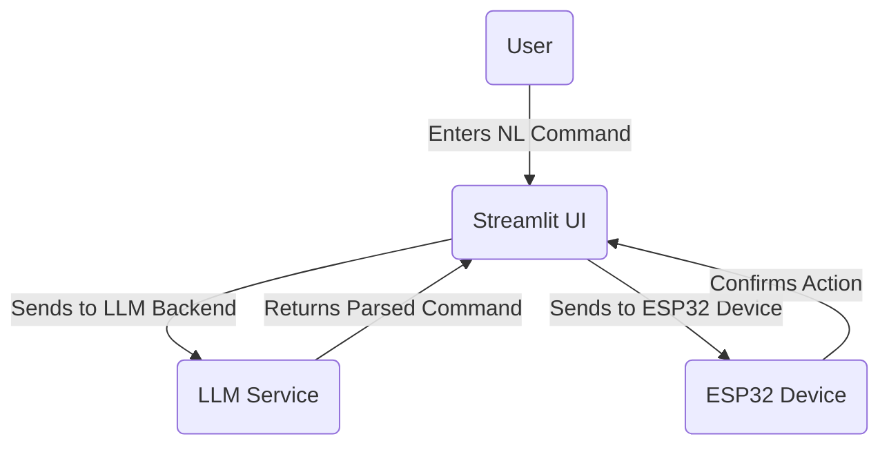
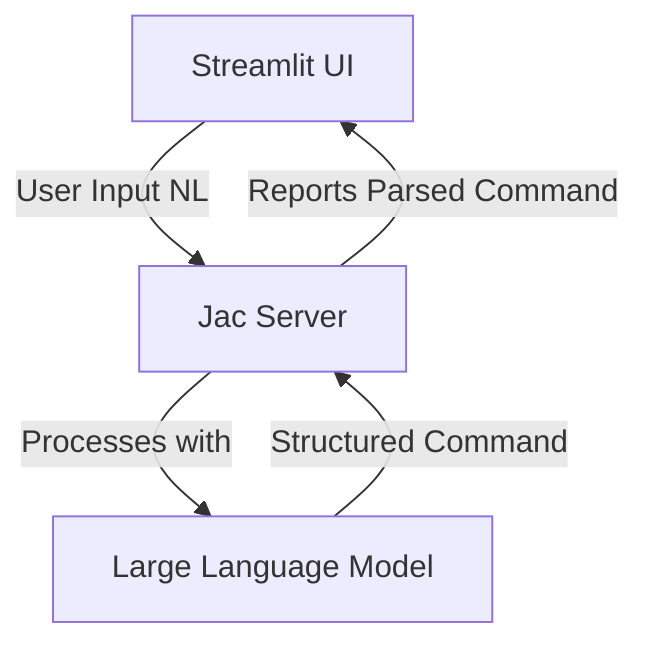
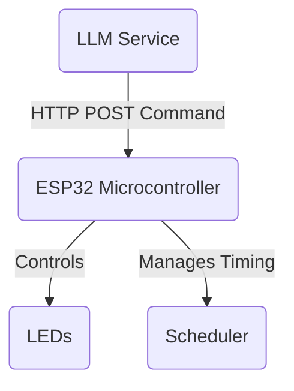
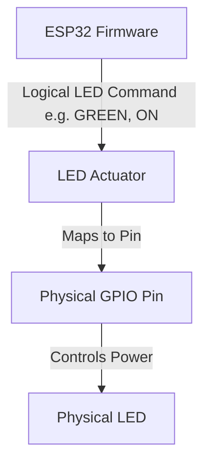
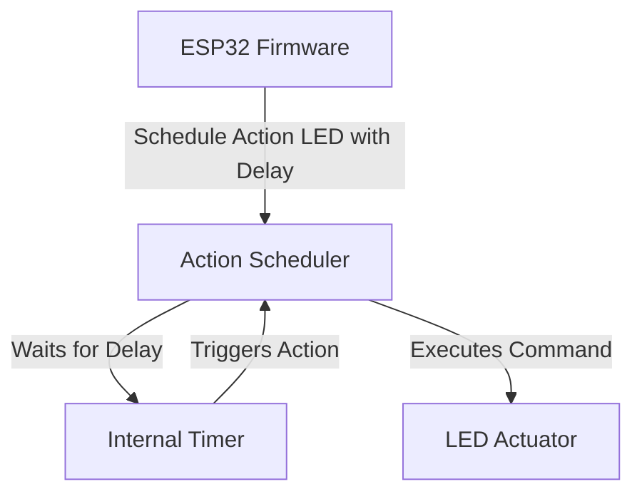
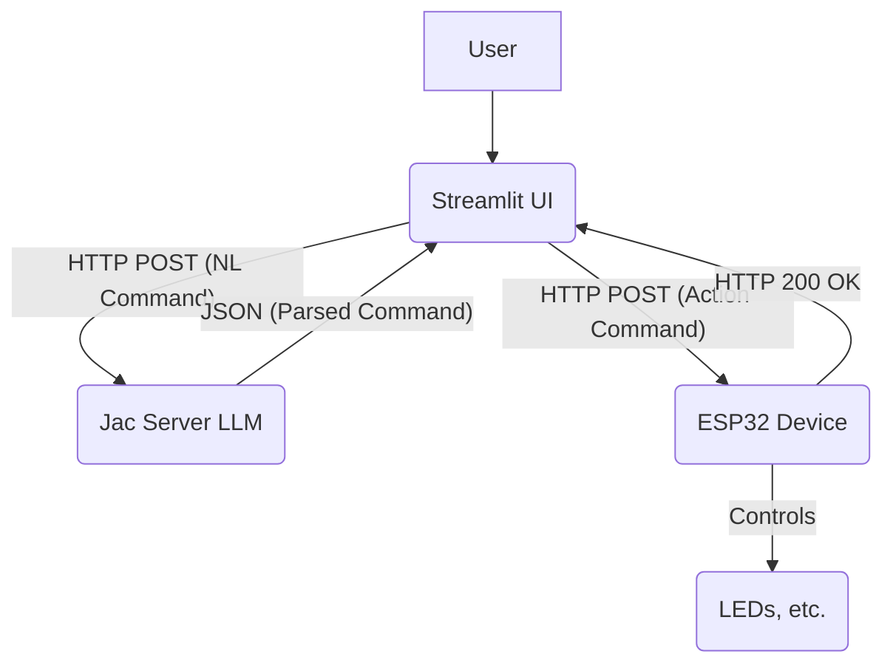

# Overview

Project Overview: Natural Language Smart Device Control System

This project delivers an intuitive and integrated system for controlling smart devices using natural language commands. Imagine simply speaking or typing "Turn the living room light green in 5 seconds" and having your device respond accordingly. Our system bridges the gap between human language and physical hardware, making smart home automation more accessible and user-friendly.

At its core, the system is designed with several key components working in harmony:

User Interaction: Your Voice, Your Command
The journey begins with the CommandControlledUI. This is a user-friendly web interface, built with Streamlit, where you can type or speak your commands in natural language. It's your window into the system, displaying the status of your requests and orchestrating the initial communication with the backend.

Understanding Your Intent: The Smart Brain
Once you've issued a command, the NLCommandInterpreter takes over. This powerful backend service, leveraging a Jac server and a Large Language Model (LLM), acts as the "brain" of our system. Its primary role is to parse your natural language input, regardless of complexity or even language (potentially), into precise, machine-readable instructions. These structured commands specify the device, the action to perform (e.g., turn on, set color), and any timing information (e.g., "in 5 seconds"). It also communicates back to the UI, providing updates on command processing.

Bringing Commands to Life: The Device Controller
With a clear instruction in hand, the ESP32DeviceController steps in. This is the firmware running on an ESP32 microcontroller, acting as the direct link to your physical devices. It manages WiFi connectivity, hosts an HTTP server to receive the structured commands from the NLCommandInterpreter, and then translates these digital instructions into real-world actions on the connected hardware components.

Specialized Hardware Control: Lights and Timers
Within the ESP32 firmware, two specialized modules ensure precise control:
- The LEDActuatorModule is dedicated to managing LEDs. It abstracts the complexity of physical pins, allowing us to refer to logical colors like YELLOW, GREEN, or BLUE, and execute simple ON/OFF commands with ease.
- For commands involving delays, the DelayedActionScheduler is crucial. This mechanism within the ESP32 allows the system to schedule hardware actions (like turning an LED on or off) to occur after a specified time. It ensures that the device remains responsive and handles pending actions efficiently without blocking other operations. The scheduler can directly queue changes for the LEDActuatorModule.

The Language of Connection: Seamless Communication
For all these components to work together flawlessly, a robust communication standard is essential. The InterServiceCommProtocol defines the common language and data formats (such as JSON over HTTP POST) used for interaction between the CommandControlledUI, the NLCommandInterpreter, and the ESP32DeviceController. This protocol ensures that data flows smoothly and reliably across the entire system, enabling seamless data exchange and a truly integrated experience.

In summary, this project creates an intelligent, end-to-end solution for natural language control of smart devices, combining a user-friendly interface, advanced language processing, and direct hardware interaction into a cohesive and powerful system.

## Chapters

### Chapter 1: Command-Controlled User Interface (UI)

# Command-Controlled User Interface (UI)

Welcome to the heart of our smart device system – the **Command-Controlled User Interface (UI)**! This is the main screen you'll interact with, built using a fantastic Python tool called Streamlit. Imagine it as your personal assistant, ready to take your natural language commands (like "Turn on the living room light") and make things happen.

This UI isn't just a pretty face; it's a powerful hub that:
*   **Listens to you**: It gathers your natural language commands.
*   **Shows you what's happening**: It displays the current status of your commands and devices.
*   **Connects everything**: It acts as the conductor, orchestrating communication between you, our smart backend (the LLM service), and the physical ESP32 smart devices.

### Key Concepts You'll Learn:

*   **Streamlit**: A super easy-to-use Python framework that lets you build interactive web applications quickly, without needing to be a web development expert.
*   **User Input**: How our system takes your everyday language commands and prepares them for processing.
*   **Frontend/Backend Communication**: Understanding how the UI talks to the powerful "brain" (our LLM service) and the "hands" (the ESP32 devices) using simple HTTP requests.
*   **Status Display**: How the UI gives you instant feedback, letting you know if your command was understood and executed.

### How It All Connects: A Visual Guide

Let's look at how the UI fits into the bigger picture:

As you can see, you (the User) give commands to the Streamlit UI. The UI then sends these commands to our backend LLM service for understanding. Once understood, the UI might send the final instruction to the ESP32 device, which then confirms the action back to the UI.

### In Conclusion

The Command-Controlled UI serves as your friendly gateway to interacting with smart devices. It cleverly hides all the complex technical stuff, giving you a smooth and responsive experience just by using your voice or typing simple commands. It's designed to make smart home control as easy as talking to a friend!

### Chapter 2: Natural Language Command Interpreter

# Natural Language Command Interpreter

Now that we've seen how you interact with the system through the UI, let's dive into the "brain" behind it all: the **Natural Language Command Interpreter**. This is a crucial backend service that takes your everyday language commands, no matter how you phrase them (even in Sinhala or Singlish!), and translates them into precise instructions that our smart devices can understand.

Think of it as a super-smart translator. When you say "Turn on the blue light in 5 seconds," this interpreter figures out:
*   **What device?** The "blue light."
*   **What action?** "Turn on."
*   **Any special conditions?** "In 5 seconds" (a delay).

It then packages all this information into a neat, structured format (like a little data message) that the frontend and the ESP32 device can easily use. This service is built using a powerful framework called Jac and powered by a Large Language Model (LLM).

### Key Concepts You'll Learn:

*   **Jac**: A modern programming language and framework specifically designed for building robust AI applications, making complex tasks like language understanding much simpler.
*   **Large Language Models (LLMs)**: These are advanced AI models trained on vast amounts of text, allowing them to understand, interpret, and generate human language with incredible accuracy. They are key to our system's ability to understand your commands.
*   **Natural Language Understanding (NLU)**: The process by which computers "read" and comprehend human language, converting it into structured data that machines can work with.
*   **Command Parsing**: The specific task of breaking down a sentence into its essential parts (device, action, delay, etc.) to extract meaningful instructions.
*   **Structured Output**: How we ensure the interpreter always produces a consistent, machine-readable format (like a JSON message) for every command, making it easy for other parts of the system to use.

### How the Interpreter Works: A Visual Guide

Here's a look at how the Natural Language Command Interpreter processes your input:

Your natural language command from the Streamlit UI goes into the Jac Server, which uses a powerful LLM to understand it. The LLM then returns a "structured command" back to the Jac Server, which then reports this parsed command back to the UI.

### In Conclusion

The Natural Language Command Interpreter is truly the brain of our smart device system. By transforming your diverse natural language inputs into precise, structured commands, it makes interacting with your devices incredibly intuitive and flexible. Thanks to LLM technology, it can understand various ways you express yourself, making the system accessible to everyone, regardless of language.

### Chapter 3: ESP32 Device Controller Firmware

# ESP32 Device Controller Firmware

Moving from the "brain" (the interpreter) to the "hands" of our system, we arrive at the **ESP32 Device Controller Firmware**. This chapter focuses on the software that runs directly on our ESP32 microcontroller – the small, powerful computer chip inside your smart device. This firmware is the unsung hero that brings your digital commands into the physical world.

The ESP32 Device Controller is a critical link because it's responsible for:
*   **Staying Connected**: Managing the WiFi connection so your device can talk to the rest of the system.
*   **Listening for Orders**: Hosting a small HTTP server that waits to receive commands from our backend (the LLM service).
*   **Taking Action**: Directly controlling the physical components, like turning LEDs on or off, by sending electrical signals.

It's the ultimate bridge, making sure your "turn on the light" command actually illuminates a physical LED.

### Key Concepts You'll Learn:

*   **ESP32 Microcontroller**: The specific type of small, low-cost, and powerful computer chip we're using. It's designed for embedded applications, meaning it's built right into devices.
*   **Firmware**: This is the software that's permanently programmed onto hardware like the ESP32. Unlike software on your computer, firmware is very specific to the device it controls.
*   **WiFi Connectivity**: How the ESP32 connects to your home network, allowing it to send and receive data wirelessly.
*   **HTTP Server**: Understanding how the ESP32 can act like a tiny website, capable of receiving commands (specifically HTTP POST requests) from other parts of our system.
*   **Hardware Control**: The exciting part! Learning how software instructions translate into physical actions, like manipulating GPIO (General Purpose Input/Output) pins to control LEDs.
*   **Embedded Systems**: The fascinating field of designing and implementing software for microcontrollers and other specialized hardware.

### How the ESP32 Controls Devices: A Visual Guide

Let's visualize the role of the ESP32 Device Controller:

Here, the NL Command Interpreter sends an HTTP POST command directly to the ESP32 Device Controller. The ESP32 then takes this command and uses it to control modules like the LED Actuator Module or to schedule actions with the Delayed Action Scheduler.

### In Conclusion

The ESP32 Device Controller forms the physical backbone of our smart device system. By combining network communication with direct hardware control, it ensures that all your parsed commands are effectively translated into real, tangible actions on your connected devices. Without it, our system would just be a bunch of clever software without any way to interact with the physical world!

### Chapter 4: LED Actuator Module

# LED Actuator Module

Let's zoom in on a specific "hand" of our ESP32 device: the **LED Actuator Module**. This is a dedicated part of the ESP32 firmware that focuses solely on controlling the LED indicators in our system. Think of it as the specialized "light switch" within the ESP32.

Why do we need a special module just for LEDs? Because it simplifies things! Instead of dealing with complex pin numbers and electrical signals every time we want to turn on a light, this module provides a much easier way. You can simply tell it, "Turn on the 'GREEN' LED," and it handles all the technical details behind the scenes. It knows which physical pin corresponds to "GREEN" and sends the correct digital signal to light it up.

This module ensures that controlling our LEDs is consistent, easy, and reliable.

### Key Concepts You'll Learn:

*   **Actuator**: Any device that converts an electrical signal into a physical action. In our case, the LED is an actuator that converts an electrical signal into light.
*   **LED Control**: The specific techniques and commands used to switch Light-Emitting Diodes on or off.
*   **GPIO (General Purpose Input/Output)**: These are the versatile pins on the ESP32 microcontroller that can be configured to send (output) or receive (input) digital electrical signals. We use them to control our LEDs.
*   **Pin Mapping**: The process of associating a logical name (like "GREEN LED") with a specific physical pin number on the ESP32. This makes our code much more readable.
*   **Digital Output**: Sending a high (ON) or low (OFF) voltage signal from a GPIO pin to control a device like an LED.
*   **Hardware Abstraction**: A powerful programming concept where we hide the complex low-level details of hardware control behind a simpler, more user-friendly interface. The LED Actuator Module is a perfect example of this.

### How the LED Actuator Module Works: A Visual Guide

Here's how the ESP32 firmware interacts with the LED Actuator Module:

The ESP32 Device Controller sends a logical command (like "GREEN", "ON") to the LED Actuator. The module then figures out which physical GPIO pin is connected to the green LED, sends the correct power signal, and lights up the Physical LED.

### In Conclusion

The LED Actuator Module is a fantastic example of how to make hardware control simple and efficient within the ESP32 firmware. By abstracting away the nitty-gritty details of pin numbers and electrical signals, it provides a clean and logical way to control our LEDs, making it much easier to implement visual feedback and status indicators in our smart device system.

### Chapter 5: Delayed Action Scheduler

# Delayed Action Scheduler

Imagine you want to turn off a light after 10 seconds. You wouldn't want your smart device to just sit there, doing nothing, for those 10 seconds, right? This is where the **Delayed Action Scheduler** comes into play! It's a clever part of the ESP32 firmware designed to execute actions *after* a specific amount of time has passed, without making the ESP32 wait idly.

This scheduler is crucial for creating more sophisticated and responsive smart device behaviors. It allows the ESP32 to receive a command like "turn off the light in 10 seconds," immediately acknowledge it, and then go back to doing other important tasks (like listening for new commands) while it quietly counts down to the scheduled action. When the time is right, it triggers the action, turning off the light.

This ensures that our ESP32 is always busy and responsive, never held up by a simple timer!

### Key Concepts You'll Learn:

*   **Scheduling**: The process of planning and executing tasks at a future point in time.
*   **Time Delay**: Waiting for a specified duration before performing an action.
*   **Non-blocking Operations**: A very important concept in embedded systems! It means the microcontroller doesn't stop and wait for a task to finish; instead, it starts the task and then immediately moves on to other things, checking back later to see if the task is ready or complete.
*   **Asynchronous Execution**: Actions that don't happen immediately when commanded but are instead executed independently at a later time.
*   **State Management**: Keeping track of all the pending commands, their specific parameters (like "which LED" and "how long to wait"), and their current timing status.
*   **Millis() Function**: A fundamental Arduino (and ESP32) function that returns the number of milliseconds since the program started. It's essential for implementing non-blocking delays and scheduling.

### How the Delayed Action Scheduler Works: A Visual Guide

Let's see how the ESP32 uses the Delayed Action Scheduler:

The ESP32 Device Controller tells the Delayed Action Scheduler to perform an action (like controlling an LED) after a certain delay. The Scheduler then uses an Internal Timer to count down. Once the delay is over, the Timer triggers the Scheduler, which then executes the command by interacting with modules like the LED Actuator Module.

### In Conclusion

The Delayed Action Scheduler is a powerful feature that makes our ESP32 devices much smarter and more flexible. By enabling time-sensitive operations without blocking other tasks, it adds a layer of intelligence that allows for complex, nuanced control over connected devices. It's a cornerstone for building truly responsive and intelligent smart home solutions!

### Chapter 6: Inter-Service Communication Protocol

# Inter-Service Communication Protocol

We've explored individual components of our smart device system: the UI, the Language Interpreter, and the ESP32 device. But how do all these separate pieces talk to each other to work as one seamless system? The answer lies in the **Inter-Service Communication Protocol**.

This chapter is all about the "rules of conversation" that define how our different components (or "services") exchange information. Think of it as the common language they all speak. By having a clear protocol, we ensure that the Command-Controlled UI, the NLCommandInterpreter (our LLM service), and the ESP32 Device Controller can understand each other perfectly, no matter what they're trying to communicate.

Our protocol primarily uses **JSON** (JavaScript Object Notation) for sending data and **HTTP POST requests** for sending these messages over the network. This is a very common and robust way for different software services to communicate.

### Key Concepts You'll Learn:

*   **Communication Protocol**: A standardized set of rules that govern how data is exchanged between two or more entities. It's like a grammar book for computer conversations.
*   **HTTP POST**: One of the standard methods used in the Hypertext Transfer Protocol (HTTP) for sending data to a web server. It's perfect for sending commands or new information.
*   **JSON (JavaScript Object Notation)**: A lightweight, human-readable, and machine-friendly format for structuring data. It's widely used for sending data between web applications and servers.
*   **API (Application Programming Interface)**: A set of definitions and protocols that allow different software components to communicate. Our communication protocol effectively defines our system's APIs.
*   **Data Serialization/Deserialization**: The process of converting data into a format suitable for transmission (serialization, like turning a Python dictionary into a JSON string) and then converting it back to its original form at the receiving end (deserialization).
*   **System Integration**: The process of connecting different subsystems or components into a single, larger system that functions cohesively. Our communication protocol is key to this integration.

### How Services Communicate: A Visual Guide

Let's visualize the entire communication flow across our system:

This diagram shows the full journey: The User interacts with the Streamlit UI. The UI sends a natural language command via HTTP POST to the LLM-powered NLCommandInterpreter. The Interpreter processes it and sends back a structured JSON command to the UI. The UI then sends an HTTP POST action command to the ESP32 Device Controller, which confirms receipt (HTTP 200 OK) and finally controls the physical Hardware like LEDs.

### In Conclusion

The Inter-Service Communication Protocol is the crucial connective tissue that binds our entire smart device system together. By establishing clear, consistent rules for data formatting and transmission, it ensures that our distinct frontend, backend, and embedded components can communicate effectively and reliably. This robust communication is what makes our complex system operate as a single, intelligent, and responsive whole.

