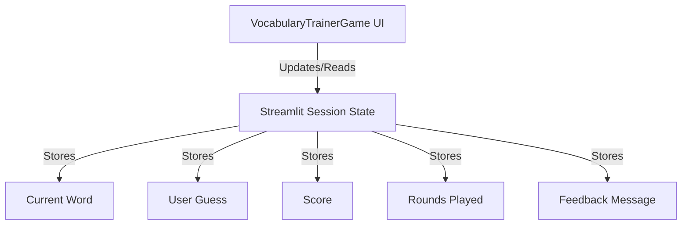
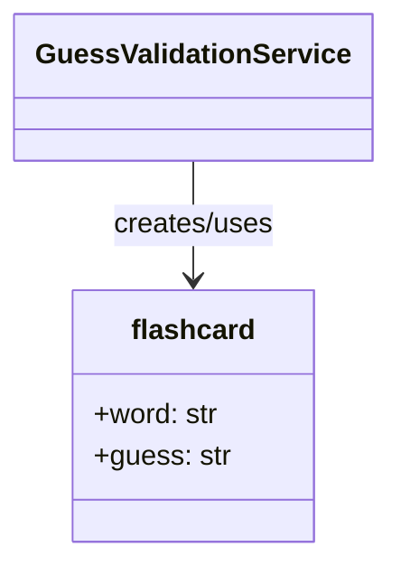

# Overview

# Vocabulary Trainer Game Project Overview

Welcome to the **Vocabulary Trainer Game**, an engaging and intelligent application designed to help users expand their vocabulary! This project leverages the power of Artificial Intelligence (AI) to create a dynamic and personalized learning experience.

## What is it?

At its core, the Vocabulary Trainer Game is a user-friendly application where you can learn new high-school level vocabulary words through an interactive guessing game. It's more than just a simple flashcard app; it actively assists your learning by providing smart feedback and tailored hints, making vocabulary acquisition both fun and effective.

## How Does It Work?

The application is structured around several key components that work together seamlessly to deliver an intelligent learning environment:

### 1. The Game Experience (VocabularyTrainerGame)
This is the primary application you interact with. It manages the overall game flow, user interface, and all user interactions. It acts as the central orchestrator, making requests to various AI-powered backend services to provide a rich and responsive game experience.

### 2. Keeping Track of Your Progress (GameSessionManagement)
Behind the scenes, this crucial component handles the persistent state of your game session. It accurately tracks your current score, the number of rounds played, the active vocabulary word you're working on, and any feedback messages displayed to you. This ensures a continuous and personalized learning journey.

### 3. Smart Word Generation (WordGenerationService)
When you're ready for a new challenge, our AI-powered **Word Generation Service** springs into action. This backend service is responsible for generating new, high-school level vocabulary words for the game. It ensures diversity and appropriate difficulty, keeping the learning fresh and challenging. Once a word is generated, it's prepared as part of a "flashcard" for your challenge.

### 4. Intelligent Guess Validation (GuessValidationService)
After you submit your guess, the **Guess Validation Service** takes over. Utilizing an advanced AI (LLM), it semantically compares your guess with the target vocabulary word. It intelligently determines the correctness of your answer, triggering appropriate game responses and informing the `GameSessionManagement` about score updates based on your performance.

### 5. Personalized Learning Support (HintAndExplanationService)
If you struggle with a word, the **Hint and Explanation Service** is there to help. This AI-driven backend service provides intelligent hints or detailed explanations specifically tailored to your incorrect guess. It uses the context of the challenge to offer insights, aiding in learning and understanding, and providing valuable learning feedback to your game session.

### 6. The Vocabulary Challenge (FlashcardDataModel)
Think of this as the digital flashcard for each vocabulary challenge. It's a simple yet crucial data structure used to encapsulate a single instance of a vocabulary challenge, storing both the target word and the user's submitted guess for processing. It acts as a common language between the different services, ensuring everyone is working with the same challenge information. The Word Generation Service populates this, and both Validation and Hint services read from it.

## The Learning Journey Flow:

1.  **Start a Round**: The `VocabularyTrainerGame` initiates a new round by requesting a new word.
2.  **Get a Word**: The `WordGenerationService` generates a unique high-school level word and populates a `FlashcardDataModel` with it.
3.  **Your Turn**: The game displays the challenge, and you enter your guess.
4.  **Check Your Answer**: Your guess is submitted to the `GuessValidationService`, which evaluates it against the `FlashcardDataModel` and informs the `GameSessionManagement` about score updates.
5.  **Learn and Progress**: If your guess was incorrect, the `HintAndExplanationService` can provide a helpful hint or explanation, leveraging the `FlashcardDataModel` context and providing learning feedback to `GameSessionManagement`.
6.  **Repeat**: The game continues, adapting to your learning pace and helping you master new vocabulary!

## Why This Project Matters

This project demonstrates how AI can be seamlessly integrated into educational tools to create more effective and engaging learning experiences. By intelligently generating content, understanding user input semantically, and providing personalized feedback, the Vocabulary Trainer Game makes learning new words an intuitive, rewarding, and highly interactive process.

## Chapters

### Chapter 1: Vocabulary Trainer Game: Core Application Architecture

Welcome to the heart of our Vocabulary Trainer Game! This chapter will guide you through the core application architecture, which is the central brain orchestrating your entire learning adventure. We'll explore how the game interacts with you, manages the flow of activities, and seamlessly connects with powerful AI-driven backend services to create an intelligent and truly engaging vocabulary learning experience. Think of it as the conductor of an orchestra, making sure all instruments play in harmony!

### Key Concepts Explored

In this chapter, we'll dive into:
- Streamlit UI
- Game Loop Management
- User Input Handling
- API Client (requests library)
- Session State Orchestration
- Backend Service Integration

### Visualizing the Architecture

To better understand how these pieces fit together, let's look at a high-level diagram:

```mermaid
graph TD
    A[User Interface (Streamlit)] --> B{VocabularyTrainerGame};
    B --> C[GameSessionManagement];
    B --> D[WordGenerationService];
    B --> E[GuessValidationService];
    B --> F[HintAndExplanationService];
    D -- LLM --> G[LLM];
    E -- LLM --> G;
    F -- LLM --> G;
```

As you can see, the Vocabulary Trainer Game acts as the user-facing facade and the central control unit. It beautifully integrates the user interface (what you see and click) with our powerful AI backend services, creating a dynamic and interactive environment where learning feels natural and fun. This core architecture is what makes our game smart and responsive!

### Chapter 2: Game Session Management and State Persistence

Building on our understanding of the core architecture, this chapter focuses on how the Vocabulary Trainer Game remembers your progress and maintains continuity across different interactions. Imagine if a game forgot your score or the word you were just learning! We'll detail the clever mechanisms used to store and update the game's state, including your current score, the number of rounds played, the active vocabulary word, and any feedback messages you receive. This ensures a consistent, personalized, and frustration-free learning journey.

### Key Concepts Explored

In this chapter, we'll dive into:
- Streamlit Session State (`st.session_state`)
- Score Tracking
- Round Counter
- Current Word Storage
- User Feedback Messages
- Game Reset Logic

### Visualizing Session State

Let's visualize how Streamlit's session state helps us keep track of everything:



Effective game session management is absolutely crucial for providing a seamless user experience. By intelligently remembering and utilizing past states, the game can guide your future interactions, track your performance, and ultimately help you achieve mastery in vocabulary.

### Chapter 3: AI-Powered Word Generation Service

Now that we've covered the game's core and how it remembers your progress, let's explore where the vocabulary words themselves come from! This chapter introduces the Word Generation Service, a crucial backend component that harnesses the power of Large Language Models (LLMs) to provide the very content of our game: new and exciting vocabulary words. We'll discover how this service intelligently generates diverse, high-school level words, ensuring the game remains challenging, educational, and never repetitive.

### Key Concepts Explored

In this chapter, we'll dive into:
- LLM Integration (Gemini)
- `def generate_word() byllm()`
- Backend API Endpoint (`/walker/VocabTrainer` with `start_game`)
- Vocabulary Diversity
- Difficulty Control

### How Words Are Generated

Here's a look at the flow for generating new words:

```mermaid
graph TD
    A[VocabularyTrainerGame] -- POST /walker/VocabTrainer (op:start_game) --> B[VocabTrainer Walker];
    B -- Calls --> C[generate_word() function];
    C -- Prompts --> D[LLM (Gemini)];
    D -- Returns New Word --> C;
    C -- Returns New Word --> B;
    B -- Reports New Word --> A;
```

The Word Generation Service, supercharged by an LLM like Gemini, is fundamental to the game's core loop. It continuously supplies fresh and appropriate vocabulary challenges, making sure your learning journey is always engaging and effective.

### Chapter 4: Semantic Guess Validation Service

You've got a word, you've made a guess – but how does the game know if you're right? This chapter unveils the Guess Validation Service, an intelligent backend component that goes far beyond simple text matching. Instead, it uses an LLM to *semantically* compare your submitted guess with the target vocabulary word. This means it understands the *meaning* and correctness of your guess, providing more nuanced feedback and triggering appropriate game responses based on how accurate your understanding is. No more getting tripped up by minor phrasing differences!

### Key Concepts Explored

In this chapter, we'll dive into:
- LLM Integration (Gemini)
- `def check_guesses() byllm()`
- Semantic Comparison
- Backend API Endpoint (`/walker/check_guess`)
- `flashcard` data model

### Validating Your Guesses

Let's see how your guesses are intelligently validated:

```mermaid
graph TD
    A[VocabularyTrainerGame] -- POST /walker/check_guess (word, guess) --> B[check_guess Walker];
    B -- Creates --> C[flashcard node];
    B -- Calls --> D[check_guesses(word, guess) function];
    D -- Prompts --> E[LLM (Gemini)];
    E -- Returns Correctness (bool) --> D;
    D -- Returns Result --> B;
    B -- Reports Correct/Incorrect --> A;
    B -- (If Incorrect) --> F[HintAndExplanationService];
```

The Guess Validation Service, with its LLM-powered semantic comparison, provides a sophisticated and intelligent way to evaluate user input. It moves beyond simple keyword matching to truly understand your intent, making the feedback much more helpful and accurate.

### Chapter 5: Contextual Hint and Explanation Service

What happens when your guess isn't quite right? This is where the Hint and Explanation Service shines! This chapter focuses on this crucial learning-aid component of our Vocabulary Trainer Game. This intelligent backend service doesn't just say 'wrong'; it dynamically generates helpful hints or detailed explanations for vocabulary words, specifically tailored to your incorrect guess. By providing relevant and timely feedback, it transforms mistakes into valuable learning opportunities, helping you understand *why* your answer was wrong and guiding you toward mastery.

### Key Concepts Explored

In this chapter, we'll dive into:
- LLM Integration (Gemini)
- `def explain_word() byllm()`
- Contextual Feedback
- Learning Reinforcement
- Dynamic Hint Generation

### Receiving Intelligent Hints

Here's how the game provides you with helpful insights:

```mermaid
graph TD
    A[GuessValidationService] -- If Guess Incorrect --> B[check_guess Walker];
    B -- Calls --> C[explain_word(word, user_guess) function];
    C -- Prompts --> D[LLM (Gemini)];
    D -- Returns Hint/Explanation --> C;
    C -- Returns Hint/Explanation --> B;
    B -- Reports Hint --> E[VocabularyTrainerGame];
    E -- Displays Hint --> F[User Interface];
```

The Hint and Explanation Service is absolutely vital for the pedagogical aspect of our game. It provides personalized and intelligent feedback that truly guides users towards understanding and mastering new vocabulary, ensuring every interaction is a step forward in your learning journey.

### Chapter 6: Flashcard Data Model for Vocabulary Challenges

Behind the scenes of every vocabulary challenge in our game is a cleverly designed data structure called the `FlashcardDataModel`. This chapter introduces this fundamental element, which acts like a digital flashcard, efficiently storing both the target word presented to you and your submitted guess for that word. This model provides a clear, organized, and consistent way to manage the core data involved in each round of the game, ensuring everything runs smoothly.

### Key Concepts Explored

In this chapter, we'll dive into:
- Jaseci Node (`node flashcard`)
- Data Encapsulation
- `word` attribute
- `guess` attribute
- Data Transfer Object

### The Flashcard Data Structure

Let's visualize the simplicity and effectiveness of our `flashcard` data model:



The `FlashcardDataModel` serves as a simple yet incredibly effective way to structure and manage the essential data for each vocabulary challenge. It facilitates clear data flow within the game's backend services, making sure that every word, every guess, and every piece of feedback is handled precisely.

