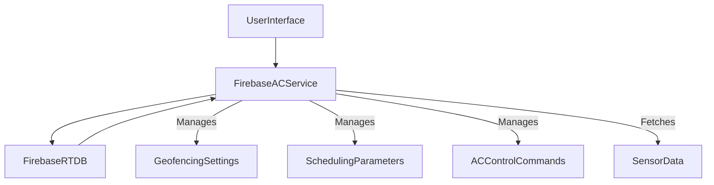
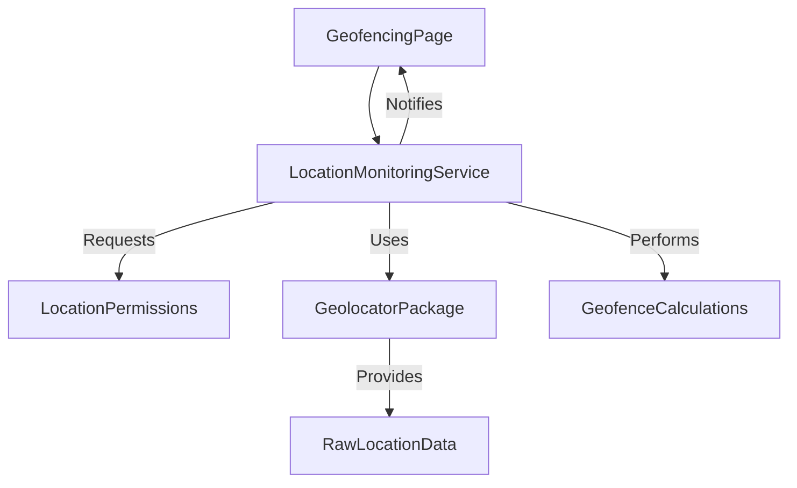
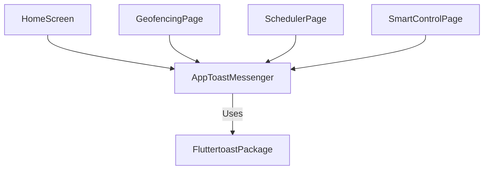
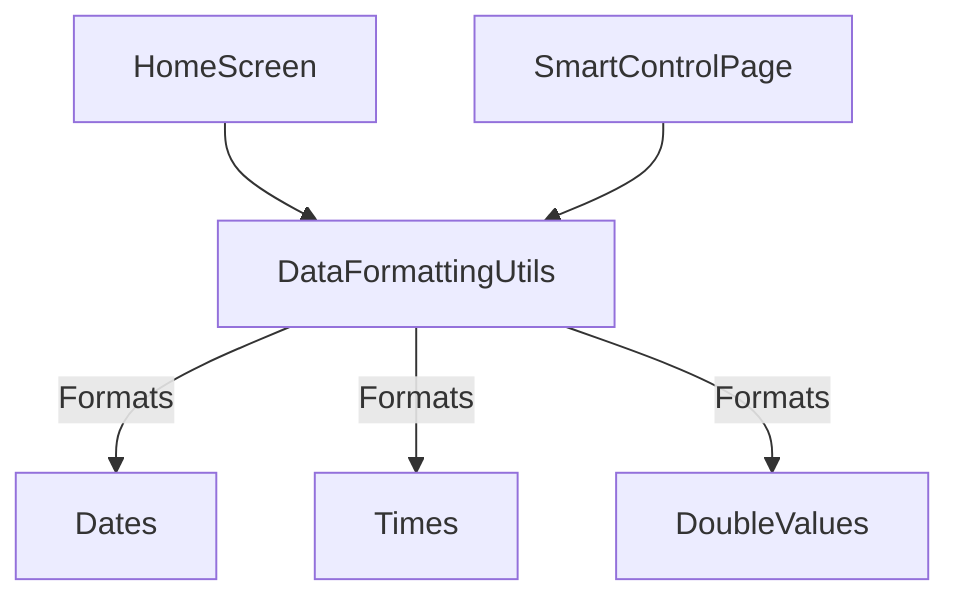
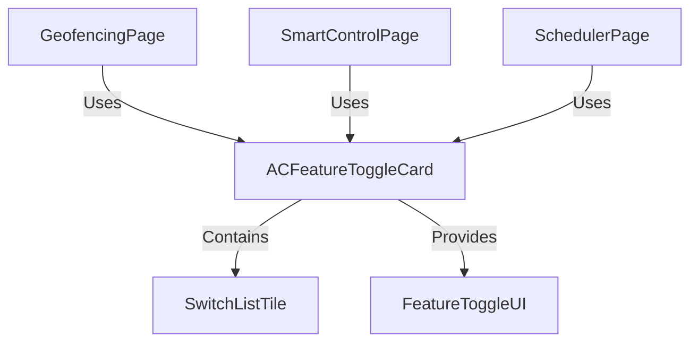
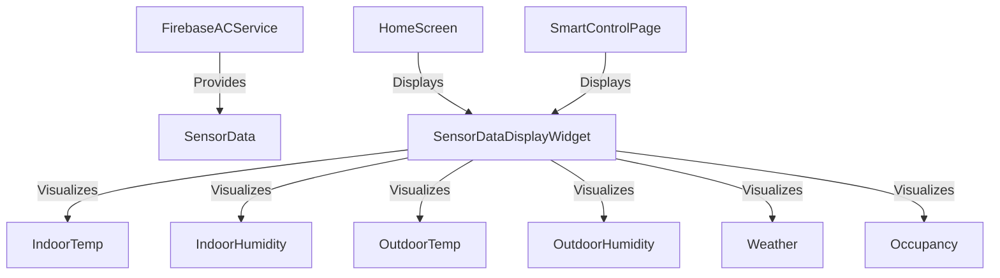

# Overview

# Project Overview: Smart AC Control Application

## Chapters

### Chapter 1: Centralized AC Control & Data Management with Firebase

Welcome to the core of our smart AC system! In this chapter, we'll explore the FirebaseACService. Think of this as the central brain that talks directly to our Firebase Realtime Database. Its main job is to keep all our AC controls, sensor data, and smart settings (like geofencing and schedules) organized and easy to manage. Instead of different parts of our app trying to talk to the database directly, everything goes through this one service. This makes our app more reliable, easier to update, and ensures all data is handled correctly.

### Key Concepts You'll Learn:

*   Firebase Realtime Database integration
*   Centralized data access and modification logic
*   AC command dispatch
*   Real-time sensor data retrieval
*   Geofencing and scheduling parameter management
*   User feedback handling.

Let's look at how this service connects everything together:

In essence, the FirebaseACService is the backbone for AC control and data management. It makes sure all interactions with Firebase are streamlined and consistent, thereby enhancing the application's reliability and scalability.

### Chapter 2: Geofence Management and Location Services

Imagine your AC turning on automatically when you're almost home! This chapter dives into how we make that happen with the LocationMonitoringService. This service is like the app's personal guide, handling all things related to your location. It takes care of asking for your permission to use your location, constantly checking where you are, and figuring out if you've entered or left a specific area (a 'geofence'). By putting all these location tasks in one place, we can easily use powerful tools like the 'geolocator' package and send out alerts when your location changes or you cross a geofence.

### Key Concepts You'll Learn:

*   Location permission management
*   Continuous location updates
*   Geolocator package integration
*   Geofence distance calculation
*   Entry/Exit event detection and notification.

Here's a simple diagram showing how our geofencing system works:

The LocationMonitoringService provides robust and reliable location-based functionalities, making it possible to implement intelligent geofencing features for automated AC control with minimal effort.

### Chapter 3: Consistent User Notifications with Toast Messenger

Have you ever noticed those small, temporary messages that pop up at the bottom of your screen to tell you something happened? Those are called 'toasts'! In this chapter, we'll meet the AppToastMessenger. This helpful tool makes sure that every time our app needs to show you a message – whether it's a success, an error, or just some info – it looks and feels exactly the same. By using the 'Fluttertoast' package through our AppToastMessenger, we avoid repeating code and guarantee a smooth, professional look for all our notifications. This means a better experience for you!

### Key Concepts You'll Learn:

*   Fluttertoast package utilization
*   Centralized notification logic
*   Consistent UI feedback
*   Uniform styling and positioning for toasts
*   Code reusability in UI components.

Let's see how different parts of our app use the AppToastMessenger:

The AppToastMessenger is vital for maintaining a professional and consistent user experience by standardizing how toast notifications are displayed across the entire application.

### Chapter 4: Standardized Data Formatting Utilities

Imagine seeing dates, times, or temperatures displayed differently across various parts of an app – it would be confusing! This chapter introduces the DataFormattingUtils, a collection of handy tools that make sure all our numbers and dates look neat and consistent. These tools help us convert raw data, like a complex date or a temperature reading, into something easy for you to read, like 'Jan 15, 2023' or '72.5°F'. By using these utilities, we avoid writing the same formatting code over and over, making our app's display clear and uniform everywhere.

### Key Concepts You'll Learn:

*   Static utility methods
*   Date and time formatting (using DateFormat)
*   Double value formatting (e.g., to one decimal place)
*   Code reusability
*   Data presentation consistency.

Here's a quick look at how DataFormattingUtils helps various screens:

DataFormattingUtils is essential for maintaining a clean and professional user interface by providing standardized formatting for all numerical and temporal data, reducing redundancy and improving readability.

### Chapter 5: Reusable Feature Toggle Widget for AC Control

When you open your app, you'll often see switches or toggles to turn features on or off, like 'Geofencing' or 'Smart AC Control'. This chapter introduces a special building block called the ACFeatureToggleCard. It's a smart Flutter widget designed to give all these 'on/off' switches a consistent look and feel. Each card typically has a clear title, a short description, and an interactive switch. By using this modular design, we make sure that all our feature controls look the same, making the app easier to use and new features simpler to add.

### Key Concepts You'll Learn:

*   Flutter widget reusability
*   Consistent UI for feature toggles
*   SwitchListTile integration
*   Styled Container for visual presentation
*   Modular UI design.

This diagram shows where the ACFeatureToggleCard is used and what it contains:

The ACFeatureToggleCard streamlines the implementation of feature toggles, ensuring a consistent and user-friendly experience across all smart AC control functionalities.

### Chapter 6: Real-time Sensor Data Visualization Widget

What's the temperature inside? How about outside? This chapter introduces the SensorDataDisplayWidget, a special Flutter widget built to show you all this important environmental data in real-time. It's designed to present information like indoor/outdoor temperature, humidity, current weather, and if someone is detected in the room, in a clear and organized way. By centralizing how we display this sensor data, we ensure you always get easy-to-understand, up-to-the-minute insights about your surroundings, right where you need them in the app.

### Key Concepts You'll Learn:

*   Flutter widget for data visualization
*   Real-time sensor data display
*   Consistent layout for environmental metrics
*   Indoor/outdoor temperature and humidity
*   Weather conditions
*   Occupancy status.

Here's a visual representation of how sensor data flows and is displayed:

The SensorDataDisplayWidget is crucial for effectively communicating real-time environmental data to the user, providing a consistent and clear overview of the immediate surroundings relevant to AC control.

