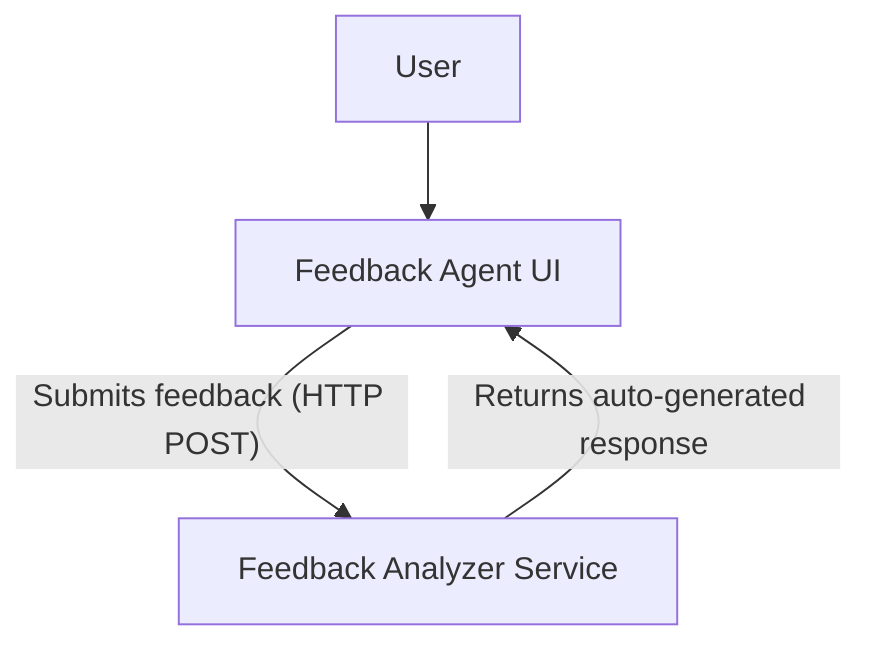
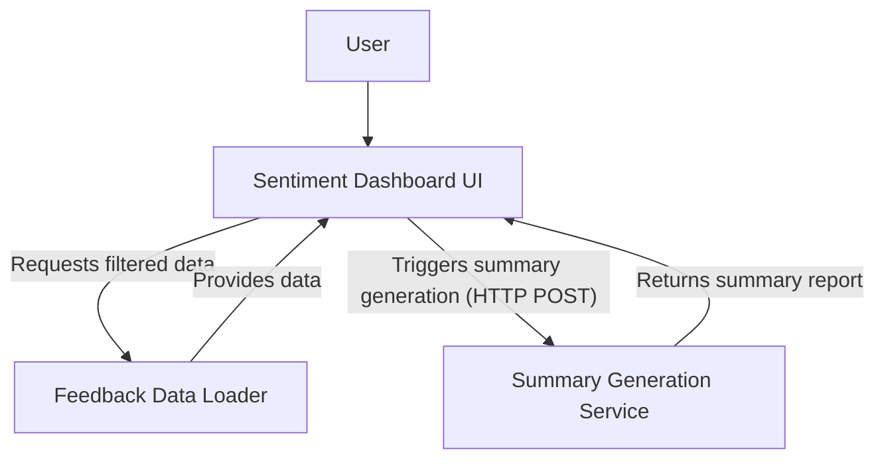
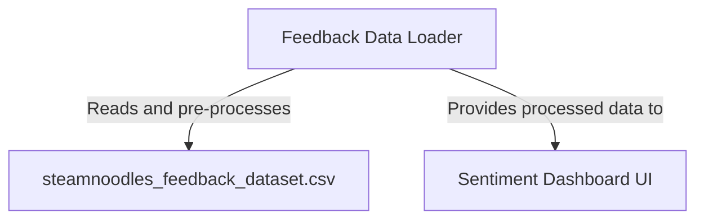
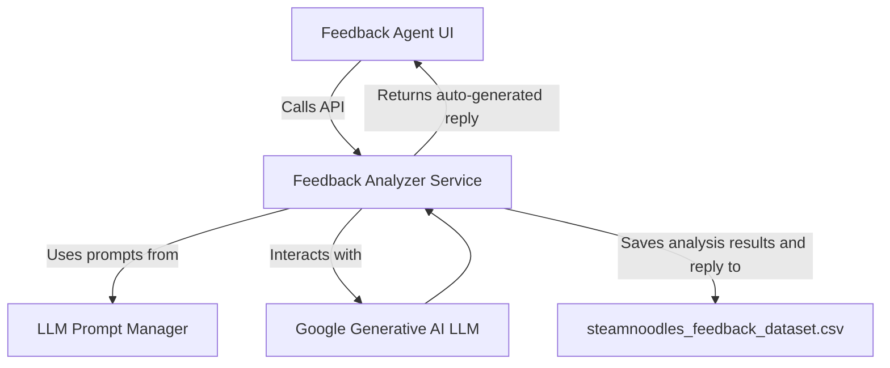
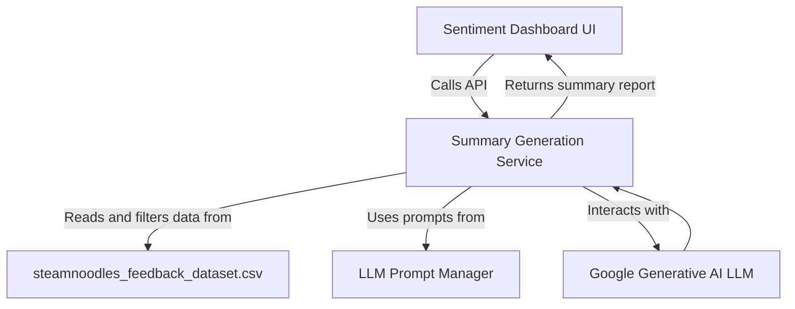
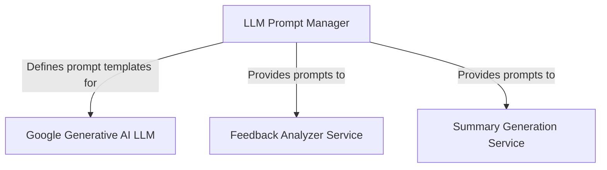

# Overview

# Customer Feedback and Sentiment Analysis System

Welcome to our **Customer Feedback and Sentiment Analysis System**! This project offers a comprehensive solution for businesses to efficiently collect, analyze, and visualize customer feedback, leveraging the power of Artificial Intelligence. It's designed to transform raw feedback into actionable insights, helping you better understand your customers and improve your services.

## How It Works: A Journey Through Customer Insights

Our system is composed of several interconnected components, working seamlessly to provide a holistic view of customer sentiment:

### 1. Submitting and Analyzing Individual Feedback

*   **Your Voice, Instantly Heard (FeedbackAgentUI):** When a customer wants to share their thoughts, they interact with the **FeedbackAgentUI**. This is a user-friendly interface, typically a web page, where they can easily type in their feedback and submit it.
*   **The AI Brain Behind the Scenes (FeedbackAnalyzerService):** Once submitted, the feedback is sent to the **FeedbackAnalyzerService**. This is where the magic of AI happens! This service uses a powerful Large Language Model (LLM) to perform a deep analysis, determining the feedback's sentiment (e.g., positive, negative, neutral), urgency, underlying emotions, and category. It even auto-generates a human-like reply, providing an instant acknowledgement to the customer.
*   **Guiding the AI (LLMPromptManager):** To ensure the AI performs its analysis precisely, the **LLMPromptManager** provides carefully crafted instructions, known as "prompts," to the LLM. These prompts guide the AI in understanding and responding to the feedback accurately.
*   **Instant Response:** The automated reply generated by the `FeedbackAnalyzerService` is then sent back and displayed on the `FeedbackAgentUI`, closing the loop with the customer. All analysis results are also saved for future reference.

### 2. Visualizing Overall Sentiment Trends

*   **Seeing the Bigger Picture (SentimentDashboardUI):** For businesses to understand broader trends, the **SentimentDashboardUI** provides an interactive dashboard. Here, users can visualize overall sentiment distribution (e.g., via pie charts showing positive vs. negative feedback), track trends over time, and filter data by specific date ranges or categories.
*   **Preparing the Data (FeedbackDataLoader):** To power this dashboard, the **FeedbackDataLoader** plays a crucial role. It efficiently loads all customer feedback data from a source (like a CSV file), pre-processes it (e.g., converting timestamps), and ensures it's perfectly formatted for display on the `SentimentDashboardUI`. This processed data is then provided to the dashboard for visualization.

### 3. Generating Comprehensive Summary Reports

*   **Unlocking Deeper Insights (SummaryGenerationService):** When a user on the `SentimentDashboardUI` wants a high-level overview of sentiment for a specific period, they can trigger the **SummaryGenerationService**.
*   This service first obtains the relevant filtered data from the `FeedbackDataLoader`. Then, similar to the individual feedback analysis, it uses an LLM (again, guided by the `LLMPromptManager`) to generate a concise, narrative summary report of the customer sentiment for that chosen date range.
*   **Summary at Your Fingertips:** The generated summary is then returned and displayed directly within the `SentimentDashboardUI`, offering valuable, AI-powered insights without requiring manual data interpretation.

## Key Technologies

This system leverages Streamlit for creating intuitive and interactive user interfaces, and harnesses the advanced capabilities of Large Language Models (LLMs) from Google Generative AI for sophisticated natural language understanding and generation.

By integrating these components, our Customer Feedback and Sentiment Analysis System empowers businesses to not only listen to their customers but truly understand them, driving informed decisions and fostering better customer relationships.

## Chapters

### Chapter 1: Feedback Agent User Interface

# Feedback Agent User Interface

Welcome to the first chapter of our tutorial! Here, we'll explore the **Feedback Agent User Interface (UI)**. Think of this as the main "face" of our application, the part that users directly interact with. Built using **Streamlit**, this UI is designed to be simple and intuitive, allowing users to easily submit customer feedback and receive instant, AI-generated responses.

## What is the Feedback Agent UI?

The Feedback Agent UI is where all the magic starts from the user's perspective. It's a web application built with **Streamlit**, a fantastic Python library that lets you create interactive web apps with minimal code.

Here's what you'll be able to do with this UI:
*   **Submit Customer Feedback**: Users can type or paste their customer feedback into a dedicated text area.
*   **Trigger Backend Analysis**: Once feedback is submitted, the UI sends it off to a powerful backend service for analysis.
*   **Display Auto-Generated Responses**: After the backend processes the feedback, the UI receives an intelligent, auto-generated reply and presents it beautifully to the user. This creates a smooth, interactive experience, making users feel heard and understood.

## Key Concepts We'll Cover

In this chapter, we'll touch upon several important concepts:
*   **Streamlit UI**: Understanding how to build interactive web applications with Streamlit.
*   **User Input Forms**: Creating text areas and buttons for users to submit data.
*   **Feedback Submission**: How the UI sends user data to a backend service.
*   **Displaying Auto-Generated Responses**: Presenting the results received from the backend.
*   **Frontend-Backend Communication**: The essential link between what the user sees (frontend) and what happens behind the scenes (backend).
*   **Interactive Elements**: Making the UI dynamic and responsive.

## How It Works: A Visual Overview

To better understand the flow, let's look at a simple diagram. This shows how a user interacts with the UI and how the UI communicates with the backend services.

As you can see:
1.  A **User** interacts with the **Feedback Agent UI**.
2.  The UI collects feedback and **Submits it** (using an HTTP POST request) to the **Feedback Analyzer Service**.
3.  The **Feedback Analyzer Service** processes the feedback and **Returns an auto-generated response**.
4.  Finally, the **Feedback Agent UI** displays this response back to the user.

## Conclusion

The Feedback Agent UI is more than just a pretty face; it's the primary point of contact for users to provide their valuable feedback. It seamlessly integrates with our intelligent backend, allowing for real-time analysis and the generation of personalized responses. This ensures that every piece of feedback is not only captured but also acted upon intelligently, making the user experience efficient and engaging.

---

### Chapter 2: Sentiment Dashboard User Interface

# Sentiment Dashboard User Interface

In this chapter, we shift our focus from individual feedback submission to broader insights. We'll explore the **Sentiment Dashboard User Interface (UI)**, another powerful component built with **Streamlit**. This UI is your window into the overall sentiment of your customer feedback, allowing you to visualize trends and gain valuable analytical insights.

## What is the Sentiment Dashboard UI?

The Sentiment Dashboard UI is an interactive analytical tool. It's designed to help you understand the "big picture" of customer sentiment. Instead of looking at one feedback entry at a time, this dashboard lets you see patterns and trends across all your collected feedback.

Key functionalities of this dashboard include:
*   **Explore Sentiment Trends**: Observe how customer sentiment changes over different periods. Are customers happier this month than last?
*   **Visualize Sentiment Distribution**: See the overall breakdown of sentiment (e.g., how much feedback is positive, negative, or neutral) through easy-to-understand charts.
*   **Apply Interactive Filters**: Customize your view by filtering data based on specific date ranges or different feedback categories. This helps you drill down into specific areas of interest.
*   **Initiate Summary Reports**: Request a comprehensive, high-level summary report from the backend, which distills complex data into actionable narratives.

## Key Concepts We'll Cover

Here are the core concepts central to the Sentiment Dashboard UI:
*   **Streamlit UI**: Further utilizing Streamlit for building data-rich, interactive applications.
*   **Data Visualization**: Creating engaging visuals like **line charts** (for trends over time) and **pie charts** (for distribution).
*   **Interactive Filtering**: Implementing widgets (like date pickers and dropdowns) to allow users to dynamically change the data displayed.
*   **Sentiment Trend Analysis**: Understanding how to interpret changes in sentiment over time.
*   **Triggering Summary Reports**: How the UI requests complex reports from a dedicated backend service.
*   **Data Display**: Efficiently presenting aggregated data in a clear and understandable manner.

## How It Works: A Visual Overview

Let's visualize how the Sentiment Dashboard UI interacts with other parts of our system to fetch and display data, and to generate reports.

From the diagram, you can see:
1.  A **User** interacts with the **Sentiment Dashboard UI**.
2.  The UI **Requests filtered data** from the **Feedback Data Loader**.
3.  The **Feedback Data Loader** processes and **Provides data** back to the UI.
4.  Alternatively, the UI can **Trigger summary generation** (via an HTTP POST request) from the **Summary Generation Service**.
5.  The **Summary Generation Service** then **Returns a summary report** to be displayed on the UI.

## Conclusion

The Sentiment Dashboard UI empowers users with a comprehensive and interactive platform to gain deep insights into customer sentiment. By enabling dynamic data exploration and high-level reporting, it transforms raw feedback into actionable intelligence, helping stakeholders make informed decisions and improve customer experience.

---

### Chapter 3: Feedback Data Loader

# Feedback Data Loader

This chapter introduces a foundational component of our system: the **Feedback Data Loader**. While the UIs provide the interactive front-end, this component works behind the scenes to prepare the raw customer feedback data, making it ready for insightful analysis and beautiful visualizations in our sentiment dashboard.

## The Role of the Feedback Data Loader

Imagine having a pile of raw, unprocessed data. Before you can make sense of it or display it nicely, you need to organize and clean it. That's precisely what the Feedback Data Loader does. It acts as the bridge between your raw data source and the parts of the application that need to use that data.

Specifically, this component is responsible for:
*   **Loading Data from a CSV File**: Our raw customer feedback is stored in a simple CSV file, named `steamnoodles_feedback_dataset.csv`. The Data Loader reads this file.
*   **Essential Pre-processing Steps**: Raw data often isn't perfectly formatted. For example, timestamps might be stored as text strings. The Data Loader converts these into proper datetime objects, which are much easier to work with for filtering and trend analysis.
*   **Transforming Raw Data**: The ultimate goal is to take this raw, sometimes messy, data and transform it into a structured, clean format that can be immediately used by the Sentiment Dashboard UI for display and analysis.

## Key Concepts We'll Cover

To understand the Feedback Data Loader, we'll explore these key ideas:
*   **CSV Data Loading**: How to read data from a Comma Separated Values (CSV) file.
*   **Pandas Library**: A powerful Python library that is indispensable for data manipulation and analysis. We'll use it extensively here.
*   **Data Pre-processing**: The crucial steps involved in cleaning and preparing raw data.
*   **Timestamp Conversion**: Converting text-based date/time information into a format that computers can easily sort, filter, and calculate with.
*   **Data Preparation**: Ensuring the data is in the correct structure and format for its intended use.
*   **Dataset Management**: Basic principles of handling and managing your data source.

## How It Works: A Visual Overview

Let's look at a simple diagram to illustrate the role of the Feedback Data Loader:

In this flow:
1.  The **Feedback Data Loader** directly **Reads and pre-processes** the data from our `steamnoodles_feedback_dataset.csv` file.
2.  Once the data is cleaned and structured, the **Feedback Data Loader** then **Provides this processed data to** the **Sentiment Dashboard UI**, which can then use it for visualizations and analysis.

## Conclusion

The Feedback Data Loader is a vital, unsung hero of our application. It ensures that the raw customer feedback is efficiently loaded, meticulously cleaned, and perfectly prepared. This robust data foundation is absolutely essential for enabling accurate sentiment analysis and for powering the insightful visualizations within our sentiment dashboard. Without it, our analysis would be prone to errors and our dashboard would lack reliability.

---

### Chapter 4: Feedback Analyzer Service

# Feedback Analyzer Service

This chapter dives into the heart of our intelligent feedback system: the **Feedback Analyzer Service**. This is a core backend component, meaning it runs behind the scenes, doing the heavy lifting of processing individual customer feedback entries. It's where the "intelligence" of our application truly resides, leveraging advanced AI to understand and respond to feedback.

## What is the Feedback Analyzer Service?

The Feedback Analyzer Service is a dedicated backend application, likely built using a framework like Flask, that receives raw customer feedback and performs a series of sophisticated analyses. It's designed to transform unstructured text feedback into structured, actionable insights.

Here's a breakdown of its key functions:
*   **Leverages a Large Language Model (LLM)**: At its core, this service integrates with a powerful Large Language Model (LLM), such as Google Generative AI, to understand the nuances of human language.
*   **Extracts Critical Information**: For each piece of feedback, the LLM is used to identify:
    *   **Fine-grained Sentiment**: Is the feedback very positive, slightly positive, neutral, slightly negative, or very negative?
    *   **Urgency Level**: Does this feedback require immediate attention?
    *   **Dominant Emotion**: What emotion does the customer primarily express (e.g., joy, anger, surprise, sadness)?
    *   **Business Category**: Which specific part of the business does the feedback relate to (e.g., product quality, customer support, delivery)?
*   **Generates Human-like Automated Replies**: Based on the analysis, the service uses the LLM to craft empathetic, context-aware, and human-like automated replies, making customers feel heard.
*   **Persists Analysis Results**: All the extracted insights and the generated reply are then saved to our central CSV dataset (`steamnoodles_feedback_dataset.csv`), ensuring we have a historical record of all processed feedback.

## Key Concepts We'll Cover

To grasp the functionality of this service, we'll explore:
*   **Flask Backend Service**: Understanding how to build a web service using the Flask framework.
*   **LLM Integration**: Connecting and interacting with a Large Language Model (like Google Generative AI).
*   **Sentiment Analysis**: Detecting the emotional tone of text.
*   **Urgency Detection**: Identifying if feedback requires immediate action.
*   **Emotion Recognition**: Pinpointing specific emotions expressed in text.
*   **Category Classification**: Assigning feedback to relevant business categories.
*   **Automated Response Generation**: Using AI to create personalized replies.
*   **CSV Data Persistence**: Saving processed data back to a CSV file.
*   **API Endpoint (`/analyze_feedback`)**: The specific web address where the service listens for feedback to process.

## How It Works: A Visual Overview

Let's visualize the intricate interactions within the Feedback Analyzer Service and its communication with other components.

Here's the detailed flow:
1.  The **Feedback Agent UI** initiates the process by **Calling the API** of the **Feedback Analyzer Service**.
2.  The **Feedback Analyzer Service** then **Uses prompts from** the **LLM Prompt Manager** to guide its interaction with the LLM.
3.  It **Interacts with** the **LLM (Google Generative AI LLM)** to perform the analysis and generate a reply.
4.  The **LLM** sends its results back to the **Feedback Analyzer Service**.
5.  The service then **Saves the analysis results and the reply to** the `CSV_File`.
6.  Finally, the **Feedback Analyzer Service** **Returns the auto-generated reply** back to the **Feedback Agent UI** for the user to see.

## Conclusion

The Feedback Analyzer Service is the intelligent backbone of our system, designed to truly understand and respond to customer feedback. By transforming raw text into actionable insights and personalized replies, it not only enhances customer experience but also provides valuable data for business improvement. It's where cutting-edge AI meets practical application.

---

### Chapter 5: Summary Generation Service

# Summary Generation Service

Moving beyond individual feedback, this chapter introduces the **Summary Generation Service**. This is another dedicated backend component, but its purpose is different: to provide high-level, narrative insights into the *overall* customer sentiment, rather than analyzing single entries. It's like getting a well-written report that summarizes all the important points.

## What is the Summary Generation Service?

The Summary Generation Service is a specialized Flask backend component designed to give you the "big picture" view of your customer feedback. Instead of just showing charts or raw data, it uses AI to craft a concise, comprehensive summary report in plain language.

Here’s how it works:
*   **Retrieves and Processes Filtered Data**: The service doesn't just look at everything. It intelligently retrieves a specific subset of feedback data from our central `steamnoodles_feedback_dataset.csv` file, based on criteria like specified date ranges from the dashboard.
*   **Utilizes a Large Language Model (LLM)**: Similar to the Feedback Analyzer, this service also leverages a powerful LLM (like Google Generative AI) to understand and synthesize large amounts of text.
*   **Crafts a Concise, Comprehensive Summary Report**: The LLM's task here is to read through the filtered feedback data and identify key trends, recurring themes, and overall sentiment shifts. It then weaves these insights into a human-readable narrative.
*   **Highlights Trends and Key Areas**: The summary report focuses on what's most important, pointing out significant trends in sentiment or specific areas of customer experience that require attention.

## Key Concepts We'll Cover

To understand this service, we'll delve into:
*   **Flask Backend Service**: Building another web service using Flask.
*   **LLM Integration**: Using a Large Language Model for data summarization.
*   **Sentiment Summary Generation**: The process of creating high-level summaries of sentiment data.
*   **Date Range Filtering**: How the service filters data based on specific time periods.
*   **Data Aggregation**: Combining and summarizing data from multiple sources or entries.
*   **Narrative Summary Production**: Generating natural language summaries from structured data.
*   **API Endpoint (`/generate_summary`)**: The specific endpoint for requesting these summary reports.

## How It Works: A Visual Overview

Let's look at the diagram to see how the Summary Generation Service fits into the overall architecture and interacts with other components.

Here’s the step-by-step process:
1.  The **Sentiment Dashboard UI** initiates the process by **Calling the API** of the **Summary Generation Service**, often providing filters like a date range.
2.  The **Summary Generation Service** then **Reads and filters data from** the `CSV_File` based on the requested criteria.
3.  It **Uses prompts from** the **LLM Prompt Manager** to instruct the LLM on how to summarize the data.
4.  The service **Interacts with** the **LLM (Google Generative AI LLM)** to generate the summary.
5.  The **LLM** returns the generated summary to the **Summary Generation Service**.
6.  Finally, the **Summary Generation Service** **Returns the summary report** back to the **Sentiment Dashboard UI** for display.

## Conclusion

The Summary Generation Service plays a crucial role in transforming vast amounts of feedback data into digestible, actionable summaries. By leveraging the power of LLMs, it enables stakeholders to quickly grasp overall sentiment, identify key trends, and focus on critical areas of customer experience, making data-driven decision-making much more accessible and efficient.

---

### Chapter 6: LLM Prompt Manager

# LLM Prompt Manager

In our journey through building an intelligent feedback system, we've seen how Large Language Models (LLMs) are central to both analyzing individual feedback and generating summary reports. This chapter introduces a crucial component that ensures these LLM interactions are effective, consistent, and tailored: the **LLM Prompt Manager**.

## What is the LLM Prompt Manager?

Think of the LLM Prompt Manager as the "brain" that tells our Large Language Models exactly what to do and how to do it. LLMs are incredibly powerful, but they need clear instructions (called "prompts") to give the best results. The Prompt Manager is responsible for creating, storing, and managing these instructions.

Here’s why it’s so critical:
*   **Definition, Formatting, and Management of Prompt Templates**: It defines a set of pre-written prompt templates. These templates are like fill-in-the-blanks forms that we can populate with specific customer feedback or data before sending them to the LLM.
*   **Specialized Templates for Feedback Analysis**: It includes specific templates designed to guide the LLM in extracting precise information from feedback, such as:
    *   **Sentiment**: What is the overall tone?
    *   **Urgency**: Does this need immediate attention?
    *   **Emotion**: What emotion is expressed?
    *   **Category**: What topic does it relate to?
*   **Templates for Empathetic Response Generation**: It also provides templates that help the LLM craft automated customer responses that are:
    *   **Empathetic**: Showing understanding and care.
    *   **Context-aware**: Relevant to the specific feedback.
    *   **Human-like**: Sounding natural and not robotic.
*   **Ensuring Aligned Output**: By centralizing prompt management, we ensure that the LLM's output consistently aligns with our specific business needs and desired tone.

## Key Concepts We'll Cover

To understand the LLM Prompt Manager, we'll explore:
*   **Prompt Engineering**: The art and science of crafting effective prompts for LLMs.
*   **Prompt Templates**: Reusable structures for prompts that can be customized.
*   **LLM Interaction**: The general principles of communicating with Large Language Models.
*   **Google Generative AI**: Specifically working with Google's powerful LLM.
*   **Feedback Analysis Prompts**: Prompts designed to extract structured data from text.
*   **Response Generation Prompts**: Prompts focused on creating natural language replies.
*   **Multilingual Support Considerations**: Briefly touching upon how prompts might need to adapt for different languages (though not explicitly implemented in this tutorial, it's a key consideration for real-world applications).

## How It Works: A Visual Overview

Let's visualize how the LLM Prompt Manager interacts with the LLM and the services that use it.

From this diagram, we can see:
1.  The **LLM Prompt Manager** is the source that **Defines prompt templates for** the **LLM (Google Generative AI LLM)**. It doesn't directly talk to the LLM for analysis, but rather prepares the "instructions."
2.  It then **Provides these prompts to** the **Feedback Analyzer Service**, which uses them when it needs to analyze individual feedback.
3.  Similarly, it **Provides prompts to** the **Summary Generation Service**, which uses them when it needs to generate high-level summaries.

## Conclusion

The LLM Prompt Manager is an indispensable component that centralizes and standardizes how we interact with our Large Language Model. By carefully defining and managing prompt templates, it ensures reliable, consistent, and tailored interactions with the LLM for both detailed feedback analysis and responsive customer communication. It's the key to unlocking the full potential of our AI models in a controlled and effective manner.

---

